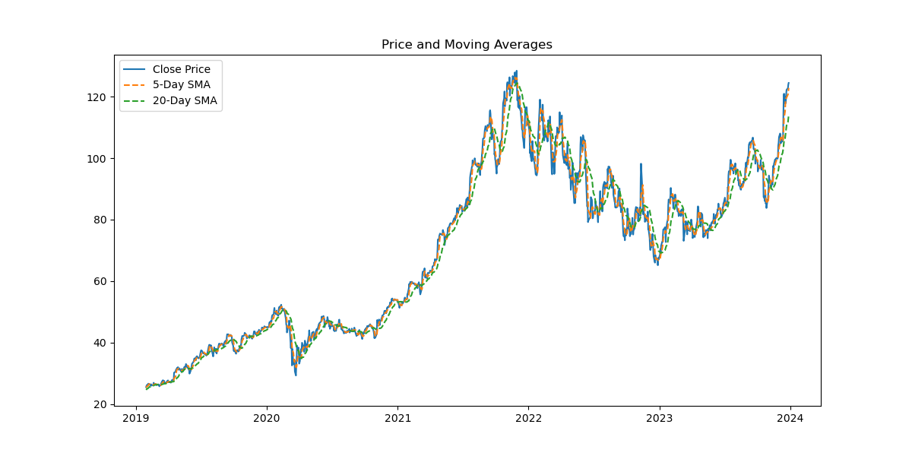
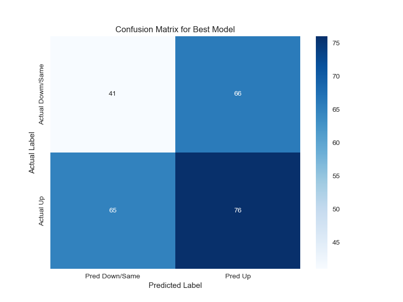

# BlackStone Stock
<!---->


## Procedures
- Import libraries
    - pandas
    - numpy
    - seaborn
    - matplotlib
    - scikit-learn
    - yfinance

```python
import yfinance as yf
import pandas as pd
import numpy as np
import matplotlib.pyplot as plt
import seaborn as sns
from sklearn.model_selection import train_test_split,GridSearchCV
from sklearn.preprocessing import StandardScaler
from sklearn.linear_model import LogisticRegression
from sklearn.neighbors import kneighbors_graph
from sklearn.svm import SVC
from sklearn.tree import DecisionTreeClassifier
from sklearn.ensemble import RandomForestClassifier
from sklearn.neighbors import KNeighborsClassifier
from sklearn.naive_bayes import GaussianNB
from sklearn.metrics import classification_report,confusion_matrix,accuracy_score
from sklearn.exceptions import ConvergenceWarning
import warnings
```   

 ---   
- Data Acquisition
    - Data Acquired from Yahoo Finance API

```python
print("Fetching Blackstone (BX) stock data...........")
# Fetch 5 years of historical data for Blackstone
data = yf.download("BX",start="2019-01-01",end="2024-01-01")

if data.empty:
    print("Error: No data fetched. Check ticker symbol or network connection.")
    

print(f"Data fetched sucessfuly. Shape: {data.shape}")
```
---
- Data Loading

| Date       | Price      | Close      | High       | Low        | Open       | Volume   |
|------------|------------|------------|------------|------------|------------|----------|
| 2019-01-02 | 23.392975  | 23.564125  | 22.179372  | 22.770615  | 22.770615  | 3,733,300 |
| 2019-01-03 | 22.739500  | 23.431877  | 22.638367  | 23.237390  | 23.237390  | 5,371,900 |
| 2019-01-04 | 23.517448  | 23.766392  | 23.190709  | 23.268504  | 23.268504  | 5,867,600 |
| 2019-01-07 | 24.217609  | 24.443216  | 23.237393  | 23.688604  | 23.688604  | 6,071,700 |
| 2019-01-08 | 24.427656  | 24.793294  | 24.100917  | 24.559908  | 24.559908  | 4,062,700 |
| ...        | ...        | ...        | ...        | ...        | ...        | ...      |
| 2023-12-22 | 123.609901 | 124.924598 | 122.238458 | 122.711370 | 122.711370 | 3,342,700 |
| 2023-12-26 | 124.253036 | 124.858364 | 123.278838 | 123.590962 | 123.590962 | 2,485,000 |
| 2023-12-27 | 125.425865 | 126.201434 | 123.505841 | 123.969301 | 123.969301 | 3,561,200 |
| 2023-12-28 | 125.917717 | 126.296041 | 124.886757 | 125.321842 | 125.321842 | 2,087,900 |
| 2023-12-29 | 123.827423 | 126.021744 | 123.222096 | 125.671779 | 125.671779 | 2,049,000 |

---

- Feature Engineering
    - Features: SMA_5, SMA_20, Volume_SMA_5, Daily_Change, Lag_5_Change, Open, High, Low, Close, Volume

```python
# We need to create features (X) and a target (y)
# Target (y): "Will the price go up tomorrow"
# 1 = Price went up, 0 = Price went dowm or stayed the same

# Calculate the change in price tommorrow
data["Price_Change"] = data["Close"].shift(-1) - data["Close"]

# Calculate the target variable: 1 if Price_Change > 0, else 0
data['Target'] = (data["Price_Change"] > 0).astype(int)

# Create features (X)
# We use past data (lags) and technical indicators

# 5-day moving average
data["SMA_5"] = data["Close"].rolling(window=5).mean()

# 20-day moving average
data["SMA_20"] = data["Close"].rolling(window=20).mean()

# 5-day moving average of volume
data["Volume_SMA_5"] = data["Volume"].rolling(window=5).mean()

# Daily percentage change
data["Daily_Change"] = (data["Close"] - data["Open"]) / data["Open"]

# Price change over the last 5 days
data["Lag_5_Change"] = data["Close"].diff(5)
```

---
- Data Cleaning
    - Drop rows with NaN values

```python
# We must drop rows with NaN values, which are created by:
# 1. rolling() windows (at the start of the dataset)
# 2. shift(-1) (the very last row, as it has no "next day" to compare)
original_shape = data.shape
data = data.dropna()
print(f"Data cleaned. Dropped NaN rows. Shape changed from {original_shape} to {data.shape}")
```

---

- Exploratory Data Visualization




---

- Feature Engineering


---

- Data Spltting
    - Split the data into training and testing sets
    - We use the shuffle=False because this is time-series data

```python
# Split data into training and testing sets
# We use shuffle=False because this is time-series data
# We want to train an older data and test on more recent data
X_train,X_test,y_train,y_test = train_test_split(X,y,test_size=0.2,shuffle=False)
print(f'Training set size: {X_train.shape[0]} samples')
print(f"Testing set size: {X_test.shape[0]} samples")
```   

---

- Data Scaling
    - Scale the features using Standard scaler
    - This is cruical for models like SVM and KNN

```python
# Scale the features
# This is cruical for models like SVM and KNN
scaler = StandardScaler()

# Fit the scaler ONLY on the training data
X_train_scaled = scaler.fit_transform(X_train)

# Transform the test data using the scaler fitted on training data
X_test_scaled = scaler.transform(X_test)
```

---

- Model Training
    - Logistic Regression
    - K-Nearest Neighbors
    - Support Vector Machine
    - Decison Tree 
    - Random Forest
    - Gaussian Naive bayes

```python
models = {
    "Logistic Regression":LogisticRegression(max_iter=1000),
    "K-Nearest Neighbors":KNeighborsClassifier(),
    "Support Vector Machine":SVC(),
    "Decision Tree":DecisionTreeClassifier(random_state=42),
    "Random Forest":RandomForestClassifier(random_state=42),
    "Gaussian Naive Bayes":GaussianNB()
}
```

---

- Model Evaluation
    - Recall
    - F1 Score
    - Precision
    - AUC and ROC
    - Confusion Matrix
    - Classification Report


---
- Post-Training Visualization





